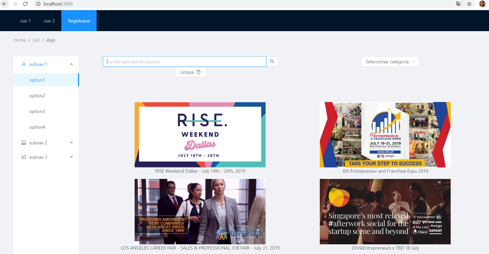
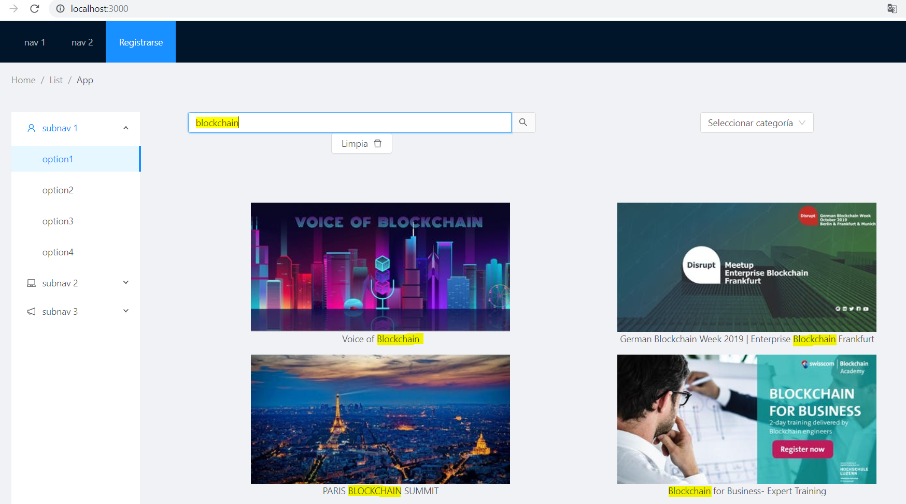
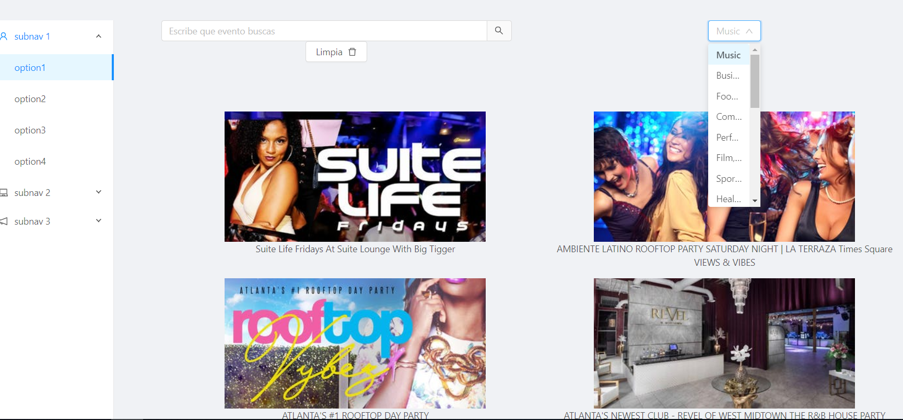
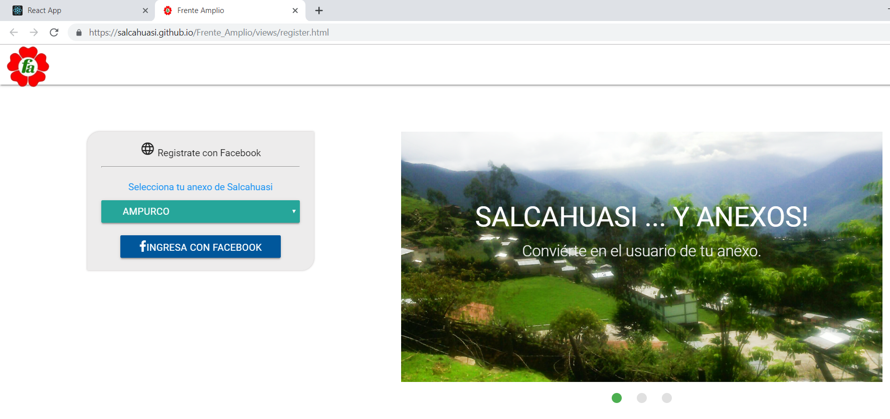

# EVENBRITE(API) - Login Facebook de una Pagina Adicional
Para la realización del proyecto se uso la Api de evenbrite la cuál contiene todos los eventos que se realizan cada día en distintas categorias (boton registrarme lleva a otra pagina prueba api facebook y firebase)
#### Busca tu evento por nombre o por categoria

#### Registrarme lleva otro link ,puedes registrarte con tu facebook y escogiendo un anexo.

### CONTENIDO:  
- Galeria de imagenes con tus eventos favoritos de todos los temas, al escribir  tu evento te muestran todos los eventos y el nombre.
- Muestra en un Select todas las categorias de eventos que contiene el API evenbrite
- Registrate te lleva aun  link de otra pagina y puedes inciar sesión con tu facebook.
### HERRAMIENTAS:  
- REACT
- ANT DESIGN
- CSS3/HTML5
- ECMASCRIPT 5/6
- EVENBRITE API (API DE EVENTOS)
*boton :REGISTRATE:
   -FACEBOOK API
   -FIREBASE

